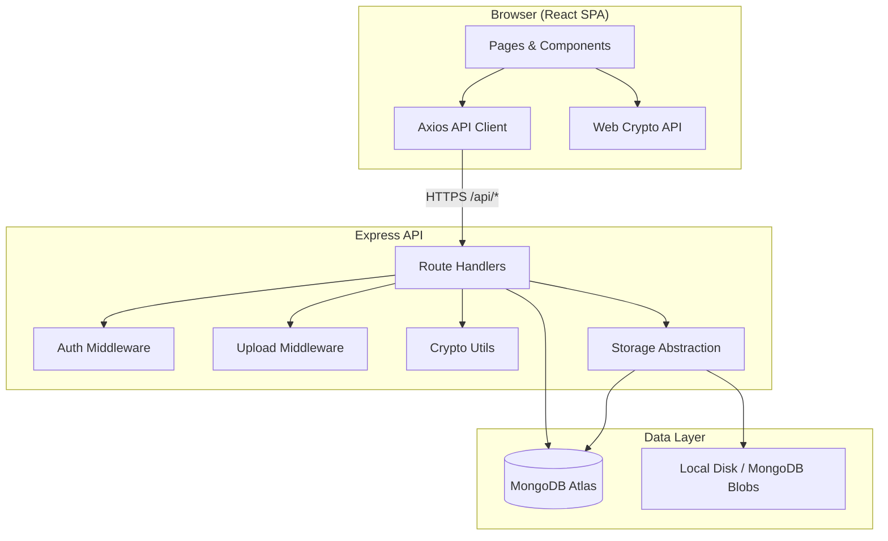
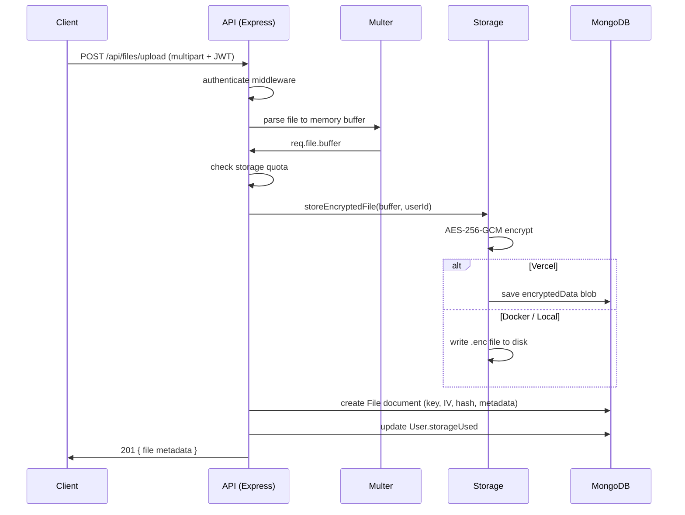
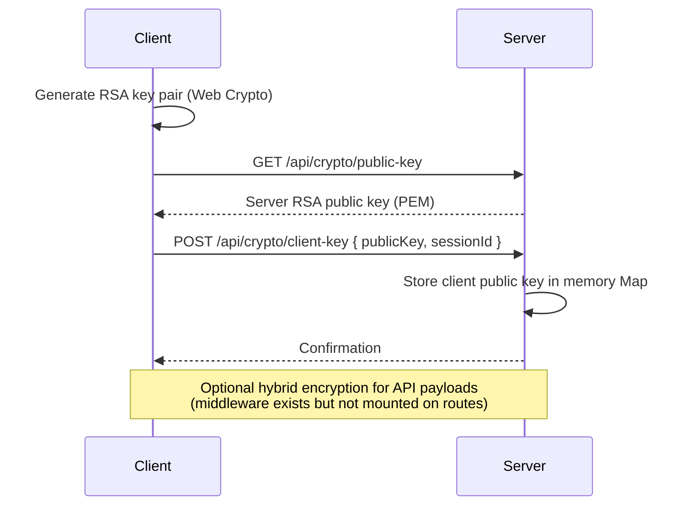
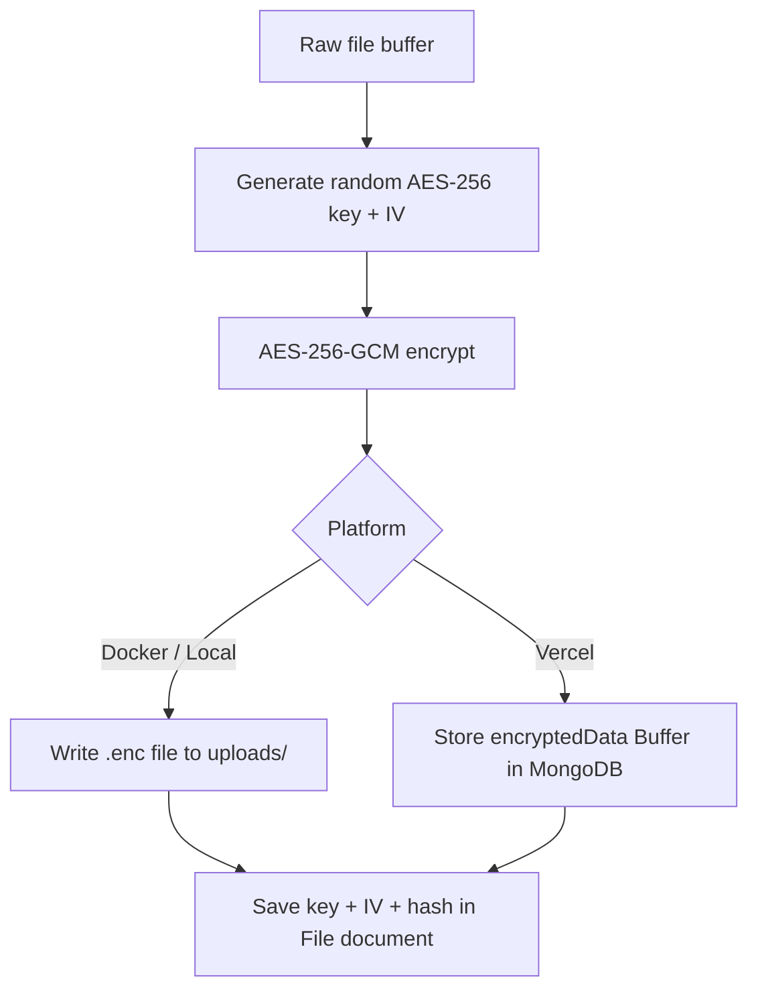
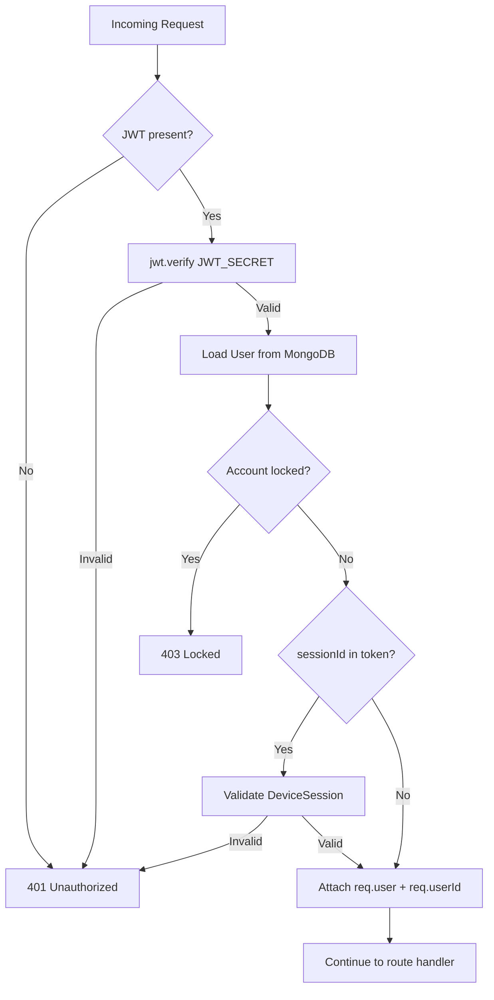
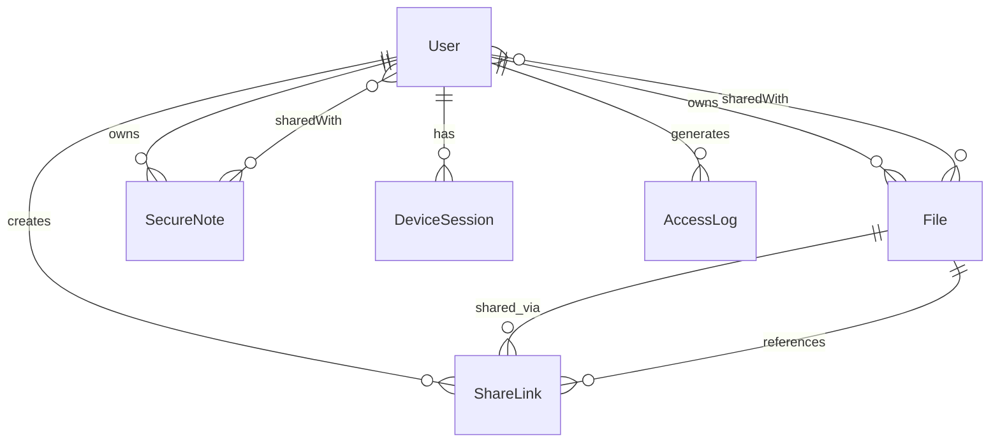

# SecureTransfer

**SecureTransfer** is a full-stack secure file transfer and vault application. It combines a React SPA with an Express API and MongoDB, using RSA+AES hybrid cryptography, JWT authentication, TOTP 2FA, share links, encrypted notes, device session management, and a full audit trail.

**Live demo:** [is-project-lake.vercel.app](https://is-project-lake.vercel.app)

---

## Table of Contents

- [Overview](#overview)
- [Features](#features)
- [Architecture](#architecture)
- [Security Implementation](#security-implementation)
- [Metrics & Analytics](#metrics--analytics)
- [Technology Stack](#technology-stack)
- [Project Structure](#project-structure)
- [Getting Started](#getting-started)
- [Environment Variables](#environment-variables)
- [Deployment](#deployment)
- [API Reference](#api-reference)
- [Data Models](#data-models)
- [Client Routes](#client-routes)
- [Limitations & Known Gaps](#limitations--known-gaps)
- [License](#license)

---

## Overview

SecureTransfer lets users upload files, share them via secure links, collaborate through an inbox, store encrypted notes, and monitor all activity from a dashboard. Files are encrypted at rest before storage; share links support passwords, expiry, download limits, and access tracing.

The app deploys as a **single unit** — static React frontend + Express API — on **Vercel** (serverless) or as a **Docker** container (monolith).

| Capability | Description |
|------------|-------------|
| File vault | Upload, preview, download, categorize, search, soft-delete |
| Share links | Public or restricted access, password, expiry, one-time access |
| Secure notes | AES-encrypted notes with sharing and permissions |
| Auth | JWT, bcrypt passwords, TOTP 2FA, account lockout |
| Devices | Session tracking, revoke, trust, rename |
| Analytics | Dashboard stats, activity feed, security events, share trace |

---

## Features

### Authentication & Account

| Feature | Details |
|---------|---------|
| Registration & login | Email/password with JWT (7-day default expiry) |
| Profile management | Update name, avatar, settings |
| Password change | Requires current password; logged in audit trail |
| Account deletion | Requires password confirmation |
| Account lockout | 5 failed logins → 15-minute lock |
| User search | Find users by email/name for direct sharing |
| Settings | Privacy mode, auto-logout timer, notification preferences |
| 2FA (TOTP) | Setup via QR code, enable/disable with verification |

### File Management

| Feature | Details |
|---------|---------|
| Upload | Multipart upload with server-side AES encryption at rest |
| Categories | `document`, `image`, `video`, `audio`, `archive`, `other` |
| Search & filter | By name, description, tags, category |
| Preview & download | Server decrypts and streams file to authorized users |
| Storage quota | Per-user limit (default 5 GB) enforced on upload |
| Inbox | Files shared directly with the user |
| Soft delete | Recoverable delete; permanent delete option |
| Blocked types | `.exe`, `.bat`, `.cmd`, `.sh`, `.ps1`, `.vbs`, `.js` |

### Share Links

| Feature | Details |
|---------|---------|
| Access modes | **Public** (anyone with link) or **Restricted** (allowed users only) |
| Password protection | Optional bcrypt-hashed password |
| Expiry | Configurable expiration date |
| Download limits | Global max downloads or per-user limits |
| One-time access | Single-use links with session tokens |
| Access trace | Full log of IP, browser, OS, device, actions |
| Short codes | Human-friendly share codes alongside tokens |
| Toggle / revoke | Activate, deactivate, or delete share links |

### Secure Notes

| Feature | Details |
|---------|---------|
| Encrypted storage | AES-256-GCM encrypted content in MongoDB |
| Organization | Categories, tags, colors, pin, favorite |
| Sharing | Share with users; view or edit permissions |
| Soft delete | Trash with optional permanent delete |

### Device & Session Management

| Feature | Details |
|---------|---------|
| Session tracking | Browser, OS, IP, device type on login |
| Revoke session | Remove individual or all other sessions |
| Trust device | Mark trusted devices |
| Rename device | Custom device labels |
| Session validation | JWT can bind to `sessionId` for live session checks |

### UI / UX

- Dark/light theme toggle
- Privacy mode (blurs sensitive filenames in UI)
- Responsive dashboard with stats cards
- Drag-and-drop upload with progress states
- Per-page browser titles
- Toast notifications for actions

---

## Architecture

### System Overview



### Deployment Topologies

```mermaid
flowchart LR
    subgraph Vercel["Vercel (Serverless)"]
        Static[client/dist Static Files]
        Fn[api/index.js Serverless Function]
        Static --> User
        Fn --> User
    end

    subgraph Docker["Docker (Monolith)"]
        Express[Express :5000]
        Express --> StaticFiles[client/dist]
        Express --> APIRoutes[/api/*]
    end

    User((User)) --> Vercel
    User --> Docker

    Vercel --> Atlas[(MongoDB Atlas)]
    Docker --> Atlas
    Docker --> FS[./uploads]
    Vercel --> Blobs[encryptedData in MongoDB]
```

### Request Flow (Authenticated Upload)



---

## Security Implementation

### Cryptographic Primitives

| Layer | Algorithm | Details |
|-------|-----------|---------|
| Key exchange | RSA-2048-OAEP (SHA-256) | Server + optional client key pairs |
| File encryption | AES-256-GCM | 12-byte IV, 16-byte auth tag prepended |
| Note encryption | AES-256-GCM | Same as files |
| Passwords | bcrypt (12 rounds) | User account passwords |
| Share passwords | bcrypt (10 rounds) | Share link passwords |
| File integrity | SHA-256 | Hash of original plaintext stored in DB |
| 2FA | TOTP (speakeasy) | ±1 time window |
| Share tokens | `crypto.randomBytes(32)` | Hex-encoded unique tokens |
| JWT | HS256 via `jsonwebtoken` | Signed with `JWT_SECRET` |

### Key Exchange Flow



### File Encryption at Rest



**Download path:** Server reads encrypted blob/path → decrypts with stored key/IV → streams plaintext to authorized client.

> **Note:** This is **encrypted-at-rest**, not true end-to-end encryption. The server holds AES keys and performs decryption. Transport is protected by HTTPS in production.

### Authentication & Authorization



| Control | Implementation |
|---------|----------------|
| JWT delivery | `Authorization: Bearer <token>` header |
| Token storage | `localStorage` on client |
| Session binding | Optional `sessionId` in JWT payload |
| File access | Owner check + `sharedWith` permissions |
| Share access | Token + password + access mode + download limits |
| CORS | Credentials enabled; origin configurable |
| Sensitive fields | Excluded from API responses (`encryptionKey`, `encryptionIV`, `storagePath`, `encryptedData`) |

### RSA Key Management

| Environment | Server keys source |
|-------------|-------------------|
| Local dev | Auto-generated in `server/keys/` |
| Docker | Auto-generated or mounted volume |
| Vercel | **Required:** `SERVER_RSA_PRIVATE_KEY` + `SERVER_RSA_PUBLIC_KEY` env vars (stable across deploys) |

Generate keys once:

```bash
openssl genrsa -out server_private.pem 2048
openssl rsa -in server_private.pem -pubout -out server_public.pem
```

Paste PEM contents into Vercel environment variables (multiline supported).

### Audit Logging

Every significant action is recorded in `AccessLog`:

- Auth: register, login, logout, password change, 2FA enable/disable, failed login
- Files: upload, download, view, delete, unshare
- Shares: create, access, delete
- Notes: create, read, update, delete, share
- Devices: revoke, trust

Each log entry includes: user, action, resource, IP, user-agent, device ID, success/failure, risk level, metadata (method, path, status code).

**Retention:** 90 days (MongoDB TTL index).

---

## Metrics & Analytics

### Dashboard Metrics (`GET /api/analytics/dashboard`)

| Metric | Description |
|--------|-------------|
| Total files | Count of user's active files |
| Files (24h / 7d) | Recent upload activity |
| Active share links | Non-expired, active links |
| Downloads (24h / 7d) | Download activity window |
| Storage used / limit | Bytes and percentage |
| Storage by category | Breakdown: document, image, video, etc. |
| 7-day activity trend | Daily action counts |
| Top 5 files | By download count |

### Security Analytics (`GET /api/analytics/security`)

| Metric | Description |
|--------|-------------|
| Failed logins (30d) | Count of failed authentication attempts |
| Unique IPs | Distinct login IP addresses |
| High/critical events | Risk-scored security events |
| Recent login locations | IP + location history |

### Share Trace (`GET /api/shares/:id/trace`)

Per-link access log: timestamp, IP, browser, OS, device type, action (view/download), user agent.

### Risk Scoring

`AccessLog.calculateRisk()` assigns risk levels:

| Level | Triggers |
|-------|----------|
| High | Password change, 2FA disable, device revoke |
| Medium | File/share/note delete, failed login |
| Low | Normal operations |

Suspicious pattern detection: multiple failed logins from same IP, logins from many distinct IPs.

### Per-Resource Counters

| Resource | Tracked fields |
|----------|---------------|
| File | `downloadCount`, `lastAccessed` |
| Note | `viewCount`, `lastAccessed` |
| ShareLink | `downloadCount`, `viewCount`, per-user download counts |
| User | `storageUsed`, `lastLogin`, `lastLoginIp` |

---

## Technology Stack

### Frontend

| Technology | Version | Purpose |
|------------|---------|---------|
| React | ^19.2.0 | UI framework |
| Vite | ^7.2.2 | Build tool & dev server |
| React Router | ^7.9.6 | Client-side routing |
| Tailwind CSS | ^4.1.17 | Styling |
| Axios | ^1.13.2 | HTTP client |
| Lucide React | ^0.554.0 | Icons |
| date-fns | ^4.1.0 | Date formatting |
| Web Crypto API | Native | Browser RSA/AES operations |

### Backend

| Technology | Version | Purpose |
|------------|---------|---------|
| Node.js | 20 (Docker) / 18+ | Runtime |
| Express | ^4.18.2 | HTTP server |
| Mongoose | ^8.0.3 | MongoDB ODM |
| jsonwebtoken | ^9.0.2 | JWT auth |
| bcryptjs | ^2.4.3 | Password hashing |
| Multer | ^1.4.5-lts.1 | File upload parsing |
| speakeasy | ^2.0.0 | TOTP 2FA |
| qrcode | ^1.5.4 | 2FA QR generation |
| ua-parser-js | ^2.0.6 | Device/browser detection |

### Infrastructure

| Service | Purpose |
|---------|---------|
| MongoDB Atlas | Primary database |
| Vercel | Serverless hosting (frontend + API) |
| Docker | Containerized monolith deployment |

---

## Project Structure

```
is-project/
├── api/
│   └── index.js                    # Vercel serverless entry point
├── client/                         # React + Vite frontend
│   ├── src/
│   │   ├── components/             # Navbar, DocumentTitle, UI primitives
│   │   ├── contexts/               # Auth, Theme, Privacy, Encryption
│   │   ├── lib/                    # crypto.js, utils.js
│   │   ├── pages/                  # 15 route pages
│   │   └── services/               # api.js (active), encryptedApi.js
│   ├── index.html
│   └── package.json
├── server/                         # Express backend
│   ├── src/
│   │   ├── app.js                  # Express app (shared: Vercel + standalone)
│   │   ├── index.js                # Standalone server entry
│   │   ├── db.js                   # Mongoose + serverless connection cache
│   │   ├── controllers/            # auth, file, share, note, device, analytics, crypto
│   │   ├── middleware/             # auth, encryption, upload
│   │   ├── models/                 # User, File, ShareLink, SecureNote, DeviceSession, AccessLog
│   │   ├── routes/                 # 7 route modules
│   │   └── utils/                  # crypto.js, storage.js
│   ├── keys/                       # Auto-generated RSA keys (local, gitignored)
│   └── uploads/                    # Encrypted files on disk (local/Docker, gitignored)
├── Dockerfile                      # Multi-stage build
├── vercel.json                     # Vercel build & rewrite config
├── captain-definition              # CapRover deploy config
├── .env.example                    # Production env template
└── package.json                    # Monorepo orchestration scripts
```

---

## Getting Started

### Prerequisites

- **Node.js** 18+
- **MongoDB** 5.0+ (local or [MongoDB Atlas](https://www.mongodb.com/atlas))
- **npm**

### Install

```bash
git clone <repository-url>
cd is-project
npm install          # installs client + server via postinstall
```

### Configure Environment

Copy and fill in environment variables:

```bash
cp .env.example .env
```

Minimum required for local development:

```env
MONGODB_URI=mongodb://localhost:27017/securetransfer
JWT_SECRET=<generate with: openssl rand -hex 32>
PORT=5000
NODE_ENV=development
BASE_URL=http://localhost:5000
UPLOAD_PATH=./uploads
MAX_FILE_SIZE=104857600
CLIENT_URL=http://localhost:5173
```

### Run Locally

**Terminal 1 — Backend:**

```bash
cd server
npm run dev
```

**Terminal 2 — Frontend:**

```bash
cd client
npm run dev
```

| Service | URL |
|---------|-----|
| Frontend | http://localhost:5173 |
| Backend API | http://localhost:5000 |
| Health check | http://localhost:5000/api/health |

### Production (Single Server)

Build client and serve everything from Express:

```bash
npm start
```

---

## Environment Variables

### Root / Production (`.env.example`)

| Variable | Required | Description |
|----------|----------|-------------|
| `MONGODB_URI` | Yes | MongoDB connection string |
| `JWT_SECRET` | Yes | JWT signing secret (32+ char random string) |
| `SERVER_RSA_PRIVATE_KEY` | Vercel | PEM private key (stable across deploys) |
| `SERVER_RSA_PUBLIC_KEY` | Vercel | PEM public key |
| `NODE_ENV` | No | `production` or `development` |
| `PORT` | No | Server port (default: 5000) |
| `BASE_URL` | No | Deployed domain URL |
| `TWO_FACTOR_APP_NAME` | No | TOTP issuer label (default: SecureFileSharing) |
| `EMAIL_*` | No | SMTP config (schema only — not implemented) |

### Server (`server/.env.example`)

| Variable | Default | Description |
|----------|---------|-------------|
| `UPLOAD_PATH` | `./uploads` | Encrypted file storage directory |
| `MAX_FILE_SIZE` | `104857600` | Max upload size in bytes (100 MB local) |
| `SESSION_TIMEOUT` | `30` | Session timeout in minutes |
| `CLIENT_URL` | `http://localhost:5173` | CORS origin for development |

### Client (`client/.env.example`)

| Variable | Default | Description |
|----------|---------|-------------|
| `VITE_API_URL` | _(empty)_ | API base URL; empty uses relative `/api` |
| `VITE_APP_NAME` | SecureTransfer | App display name |

### Platform (auto-set)

| Variable | Set by | Effect |
|----------|--------|--------|
| `VERCEL` | Vercel | Enables MongoDB blob storage, 4 MB upload cap |
| `CLIENT_DIST_PATH` | Docker | Path to built client (`/app/client/dist`) |

---

## Deployment

### Vercel (Recommended)

Single deployment: static frontend + serverless API.

1. Push repository to GitHub
2. Import project at [vercel.com/new](https://vercel.com/new)
3. Set environment variables:

   | Variable | Value |
   |----------|-------|
   | `MONGODB_URI` | MongoDB Atlas connection string |
   | `JWT_SECRET` | Random 32+ char secret |
   | `SERVER_RSA_PRIVATE_KEY` | PEM private key |
   | `SERVER_RSA_PUBLIC_KEY` | PEM public key |
   | `NODE_ENV` | `production` |

4. Deploy — Vercel reads `vercel.json` automatically

**What happens on deploy:**

```
npm install          → installs client + server
npm run vercel-build → builds client/dist
/api/*               → serverless function (api/index.js)
/*                   → static SPA from client/dist
```

**Vercel config highlights (`vercel.json`):**

| Setting | Value |
|---------|-------|
| Build command | `npm run vercel-build` |
| Output directory | `client/dist` |
| Function timeout | 60 seconds |
| Function memory | 1024 MB |

**MongoDB Atlas:** Allow network access from `0.0.0.0/0` or Vercel IP ranges.

**CLI deploy:**

```bash
npx vercel --prod
```

### Docker

Multi-stage build: client build → production server with static files.

```bash
docker build -t securetransfer .
docker run -p 5000:5000 \
  -e MONGODB_URI="mongodb+srv://..." \
  -e JWT_SECRET="your-secret" \
  securetransfer
```

App available at http://localhost:5000 (frontend + API on same port).

### CapRover

Uses `captain-definition` pointing to `./Dockerfile`.

---

## API Reference

Base URL: `/api`

### Health

| Method | Path | Auth | Description |
|--------|------|------|-------------|
| GET | `/health` | No | Server status + platform info |

### Crypto

| Method | Path | Auth | Description |
|--------|------|------|-------------|
| GET | `/crypto/public-key` | No | Server RSA public key |
| GET | `/crypto/server-public-key` | No | Alias for above |
| POST | `/crypto/client-key` | No | Register client public key |
| POST | `/crypto/client-public-key` | No | Alias for above |

### Auth

| Method | Path | Auth | Description |
|--------|------|------|-------------|
| POST | `/auth/register` | No | Create account |
| POST | `/auth/login` | No | Login (supports 2FA code) |
| POST | `/auth/logout` | Yes | Logout |
| GET | `/auth/me` | Yes | Current user profile |
| PUT | `/auth/profile` | Yes | Update profile |
| POST | `/auth/change-password` | Yes | Change password |
| GET | `/auth/settings` | Yes | Get user settings |
| PUT | `/auth/settings` | Yes | Update settings |
| DELETE | `/auth/account` | Yes | Delete account |
| POST | `/auth/2fa/setup` | Yes | Generate 2FA secret + QR |
| POST | `/auth/2fa/enable` | Yes | Enable 2FA with TOTP code |
| POST | `/auth/2fa/disable` | Yes | Disable 2FA |
| GET | `/auth/users/search` | Yes | Search users for sharing |

### Files

| Method | Path | Auth | Description |
|--------|------|------|-------------|
| GET | `/files/stats/summary` | Yes | File statistics by category |
| GET | `/files/shared` | Yes | Inbox — files shared with user |
| POST | `/files/upload` | Yes | Upload file (multipart) |
| GET | `/files` | Yes | List files (paginated, searchable) |
| GET | `/files/:id` | Yes | File details + share links (owner) |
| GET | `/files/:id/preview` | Yes | Inline preview (decrypted) |
| GET | `/files/:id/download` | Yes | Download (decrypted) |
| PUT | `/files/:id` | Yes | Update metadata |
| DELETE | `/files/:id/share` | Yes | Remove shared user |
| DELETE | `/files/:id` | Yes | Delete file |

### Shares

| Method | Path | Auth | Description |
|--------|------|------|-------------|
| POST | `/shares/create` | Yes | Create share link |
| GET | `/shares` | Yes | List user's share links |
| DELETE | `/shares/:id` | Yes | Delete share link |
| PUT | `/shares/:id/toggle` | Yes | Activate/deactivate link |
| GET | `/shares/:id/trace` | Yes | Access trace log |
| GET | `/shares/:token` | Optional | Access shared file metadata |
| GET | `/shares/:token/preview` | Optional | Preview via share token |
| GET | `/shares/:token/download` | Optional | Download via share token |

### Notes

| Method | Path | Auth | Description |
|--------|------|------|-------------|
| POST | `/notes` | Yes | Create encrypted note |
| GET | `/notes` | Yes | List notes |
| GET | `/notes/:id` | Yes | Get note |
| PUT | `/notes/:id` | Yes | Update note |
| DELETE | `/notes/:id` | Yes | Delete note |
| POST | `/notes/:id/share` | Yes | Share note with user |

### Devices

| Method | Path | Auth | Description |
|--------|------|------|-------------|
| GET | `/devices` | Yes | List active sessions |
| DELETE | `/devices/:id` | Yes | Revoke session |
| POST | `/devices/revoke-all` | Yes | Revoke all other sessions |
| PUT | `/devices/:id/trust` | Yes | Mark device as trusted |
| PUT | `/devices/:id/rename` | Yes | Rename device |

### Analytics

| Method | Path | Auth | Description |
|--------|------|------|-------------|
| GET | `/analytics/dashboard` | Yes | Dashboard statistics |
| GET | `/analytics/activity` | Yes | Recent activity feed |
| GET | `/analytics/summary` | Yes | Action summary over N days |
| GET | `/analytics/security` | Yes | Security event analytics |
| GET | `/analytics/files/:id` | Yes | Per-file activity log |

---

## Data Models

### User

```
name, email (unique), password (bcrypt)
avatar, publicKey
twoFactorEnabled, twoFactorSecret
settings: { privacyMode, autoLogoutMinutes, emailNotifications, shareNotifications }
plan: free | pro | enterprise
storageUsed, storageLimit (default 5 GB)
lastLogin, lastLoginIp, failedLoginAttempts, lockUntil
emailVerified, emailVerificationToken, passwordResetToken
```

### File

```
name, originalName, storagePath
encryptedData (Buffer — Vercel only)
encryptionKey, encryptionIV (AES-256-GCM)
size, encryptedSize, mimeType, hash (SHA-256)
category, description, tags[]
owner (ref User)
isPublic, sharedWith[{ user, permissions, sharedAt }]
downloadCount, lastAccessed
isDeleted, deletedAt, expiresAt (TTL)
```

### ShareLink

```
token, shortCode
file (ref File), createdBy (ref User)
permissions, accessMode: public | restricted
allowedUsers[], password (bcrypt), isPasswordProtected
maxDownloads, downloadCount, userDownloadCounts[]
oneTimeAccess, usersWhoAccessed[], accessSessions[]
expiresAt, isActive
accessLog[{ ip, userAgent, browser, os, deviceType, action, timestamp }]
recipientEmail, message, notifyOnAccess
```

### SecureNote

```
title, content (encrypted), encryptionKey, encryptionIV
owner, category, tags[], color
isPinned, isFavorite, isShared
sharedWith[{ user, permissions }]
isDeleted, deletedAt, expiresAt
lastAccessed, viewCount
```

### DeviceSession

```
user, sessionToken, deviceId, deviceName, deviceType
browser, browserVersion, os, osVersion
ip, location, publicKey
isActive, isTrusted, lastActivity
expiresAt, revokedAt, revokedReason
```

### AccessLog

```
user, action (enum), resourceType, resourceId, resourceName
ip, userAgent, location, deviceId, sessionId
success, errorMessage, metadata, riskLevel, flags[]
TTL: 90 days
```

### Entity Relationships



---

## Client Routes

| Path | Page | Access |
|------|------|--------|
| `/` | Landing | Public |
| `/signup` | Sign Up | Public |
| `/login` | Log In | Public |
| `/dashboard` | Dashboard | Protected |
| `/upload` | Upload Files | Protected |
| `/files/:id` | File Details | Protected |
| `/share/:id` | Share Settings | Protected |
| `/share-link/:linkId/trace` | Share Trace | Protected |
| `/share/public/:token` | Public Share Access | Public |
| `/inbox` | Inbox | Protected |
| `/secure-note` | Secure Notes | Protected |
| `/settings` | Settings | Protected |
| `/devices` | Device Management | Protected |
| `/help` | Help Center | Public |

---

## Limitations & Known Gaps

### Platform Limits

| Limit | Local/Docker | Vercel |
|-------|-------------|--------|
| Max upload size | 100 MB (configurable) | **4 MB** |
| File storage | Disk (`./uploads`) | MongoDB blob (`encryptedData`) |
| MongoDB doc size | N/A | 16 MB BSON limit per file |
| Serverless timeout | N/A | 60 seconds |
| Files per request | 10 | 10 |
| Default storage quota | 5 GB/user | 5 GB/user |
| Access log retention | 90 days | 90 days |
| Device session expiry | 7 days | 7 days |
| Share access session | 1 hour | 1 hour |

### Security Caveats

| Item | Status |
|------|--------|
| Encrypted at rest | Implemented |
| True end-to-end encryption | **Not implemented** — server holds AES keys |
| Transport encryption middleware | Defined but **not mounted** on routes |
| HTTPS | Required in production (provided by Vercel) |
| Client RSA keys | Stored in `localStorage` |
| Server client-key Map | In-memory — lost on cold start / not shared across instances |
| Rate limiting | Schema enum exists; **no middleware** |
| Email verification / password reset | Schema fields exist; **no routes or email sending** |

### Upload Restrictions

Blocked file extensions: `.exe`, `.bat`, `.cmd`, `.sh`, `.ps1`, `.vbs`, `.js`

---

## License

MIT

---

<p align="center">
  <strong>SecureTransfer</strong> — Your files. Encrypted. Controlled.
</p>
